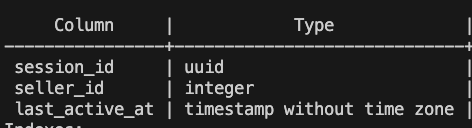

# distributed-systems-programming-assignments
Repository containing all the programming assignments for CSCI-5673: Distributed Systems Spring 2026.

# System Design

The overall system is structured logically as follows:

Container 1: Seller CLI + API Client (Seller Frontend)

Container 2: Seller Server (Seller Backend)

Container 3: Buyer CLI + API Client (Buyer Frontend)

Container 4: Buyer Server (Buyer Backend)

Container 5: customer-db

Container 6: product-db

Each process runs as a Docker container. The `docker-compose.yml` file has the setup to manage all containers.

The database nodes run PostgreSQL databases.

All communication between the frontend and backend are happening through TCP sockets. All the messages are length-prefixed, which means that the first 4 bytes of each message contains the length of the message in bytes. The receiver of the message reads the first 4 bytes, determines the message length, say x, and then proceeds to read the next x bytes.

### Search Items Semantics

The `SearchItems` operation on the buyer interface filters items using a two-stage approach, where the `category` column takes precedence over the `keywords` column:

1. **Category filtering**: Items are first filtered by the category parameter
2. **Keyword filtering**: From the category-filtered results, items containing any of the provided keywords are returned

**Example**:
- Input: Category = 0, Keywords = ["Black", "Keyboard"]
- Output: All items in category 0 that contain either "Black" OR "Keyboard" (or both) in the keywords column
### Session Management
Buyer and Seller sessions are being maintained on the backend by the server, by maintaining two tables in the customer database - `buyer_sessions` and `seller_sessions`. The schemas for the two tables are as follows:




When a user (buyer or seller) logs into their account, the server generates a new `session_id` and stores it in the respective sessions table along with the current timestamp (`NOW()`). The `session_id` is then returned to the frontend to display the "logged in" menu.
                  
Everytime the user performs an operation (like `GetItems`), the server first checks the sessions table to see if the session is still valid, by checking that the time-interval between the `last_active_at` timestamp and the current timestamp is less than 5 minutes. If the session is valid, the server updates the `last_active_at` timestamp and continues with the operation. Else it deletes the row from the sessions table and sends a "session timeout" message to the frontend. The frontend then flushes the session and displays the "logged out" menu.

### Cart Management

Carts are managed for buyers.
Two tables maintain carts for a buyer - `active_carts` and `saved_carts`. The table schema contains cart id, buyer id or session id, and a json of `{item_id : quantity}` key-value pairs.

An active cart is associated to a specific session and a saved cart is associated to a specific buyer.

When a buyer creates a new account, the buyer server creates a new entry in the buyers table with a new saved cart ID.

When a new session is created, the buyer server creates a new session entry in the sessions table with a new active cart ID.

When a session terminates, the session row is deleted and the delete is cascaded to delete the corresponding active cart. 

On buyer login, if the buyer's saved cart contains items, then these items are loaded into the new active cart. Otherwise, an empty active cart is created.

Add to cart, remove from cart, and display cart operations are performed on the active cart. Save cart saves the overwrites the active cart items over the saved cart items of that buyer. Clear cart clears both the active cart and the saved cart.

## Assumptions:

1. API client requests a TCP connection to the server when the client is initialised.
It then ensures that there is an active connection by sending requests to the server via
`send_message_with_reconnect`. This method first checks if there is an active connection still. If not, it makes one retry attempts to send a new TCP connection request to the server. So, we make an assumption here that the single retry will create a new successful connection to the server 

    Optimization: Adding multiple retries with exponential backoff

2. Implementation detail: Clear Cart clears the active cart as well as the saved cart

3. Save Cart: save cart is implemented to overwrite the current save cart with the current active cart. Ordering of save cart across sessions is not considered.

    Optimization: Implement some locking mechanism

### Reproduction Commands
Terminal 1:
```
sh build_containers.sh
docker-compose ps
```

Terminal 2:
```
docker exec -it seller_client_container python seller_cli.py
```

Terminal 3:
```
docker exec -it customer_db_container psql -U customer_user -d customer_db
```

Terminal 4:
```
docker exec -it product_db_container psql -U product_user -d product_db
```

Terminal 5:
```
docker exec -it buyer_client_container python buyer_cli.py
```

## GCE creation commands:

Setup project and authenticate to gcloud with

`gcloud auth login`

Create a new VM instance

```
gcloud compute instances create pa1-vm \
  --zone=us-west1-b \
  --machine-type=e2-medium \
  --boot-disk-size=20GB \
  --image-family=ubuntu-2204-lts \
  --tags=pa1 \
  --image-project=ubuntu-os-cloud \
  --metadata=startup-script='#!/bin/bash
    apt-get update
    apt-get install -y docker.io docker-compose
    apt-get install -y git
    systemctl enable docker
    systemctl start docker
    usermod -aG docker $USER
    apt-get install -y curl wget vim'
```

Setup firewall rules to allow traffic to server ports on the VM

```
gcloud compute firewall-rules create allow-seller-server \
  --allow=tcp:5001 \
  --target-tags=pa1 \
  --description="Allow traffic on seller server port 5001" \
  --direction=INGRESS
```

```
gcloud compute firewall-rules create allow-buyer-server \
  --allow=tcp:6001 \
  --target-tags=pa1 \
  --description="Allow traffic on buyer server port 6001" \
  --direction=INGRESS
```

SSH to GCE:
```
gcloud compute ssh pa1-vm --zone=us-west1-b
```

Inside the SSH session, clone repository:
```
git clone https://github.com/anirudhragam/distributed-systems-programming-assignments.git
```

Setup docker user
```
sudo usermod -aG docker $USER
```

Bring up services:
```
cd services
sudo chmod +x build_containers.sh
git pull
bash build_containers.sh
```

Run performance tests:
```
python performance_tests.py --num-sellers 1 --num-buyers 1 > results_1x1.txt 2>&1 | tee results_1x1.txt

python performance_tests.py --num-sellers 10 --num-buyers 10 > results_10x10.txt 2>&1 | tee results_10x10.txt

python performance_tests.py --num-sellers 100 --num-buyers 100 > results_100x100.txt 2>&1 | tee results_100x100.txt
```


